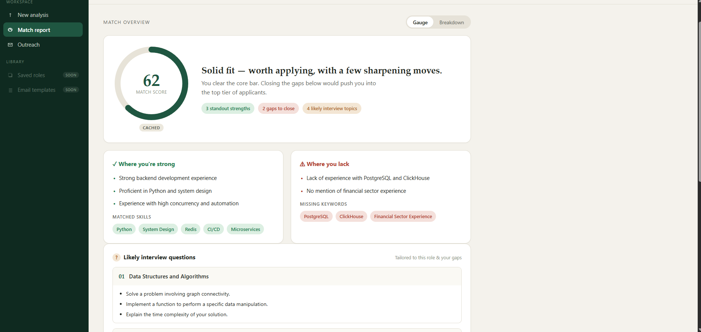
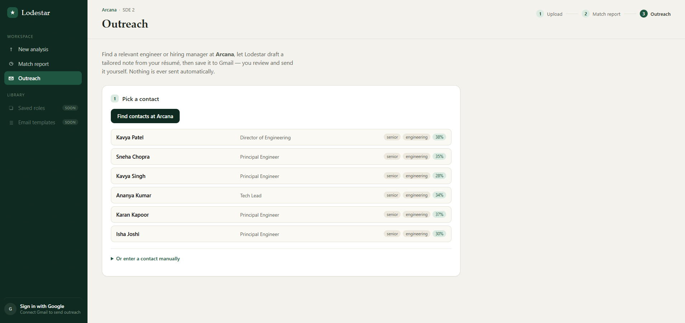
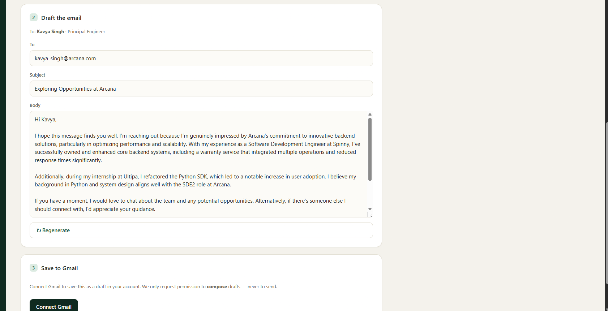
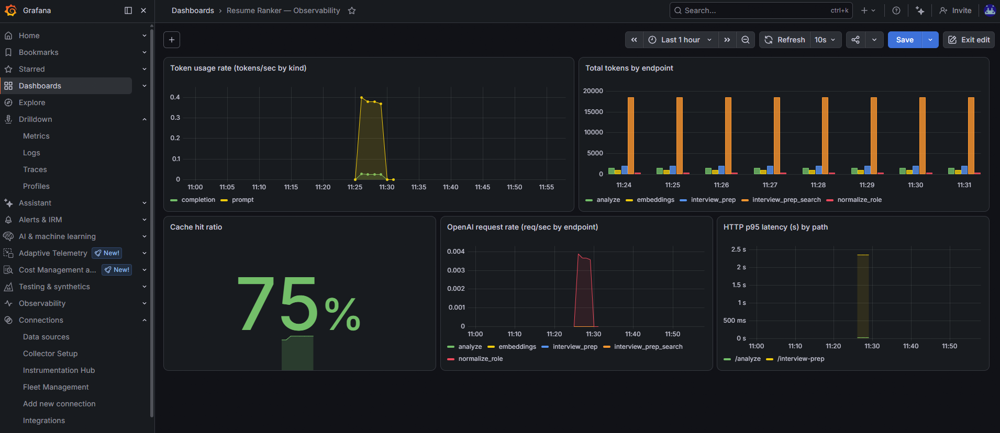

# Lodestar - AI Resume Match & Outreach Co-Pilot

A candidate-side tool that takes you from *"should I apply?"* to a drafted cold email - in three steps:

1. **Resume <-> JD hybrid scoring** - upload a resume PDF + paste a job description, get an *explainable* match score (three independent signals), matched skills, missing skills, strengths, gaps, and concrete suggestions.
2. **Interview prep** - enter a company + role, get a live-web-search summary of that company's interview process (rounds, frequent question types, and **example questions per topic**) with source links.
3. **Outreach** - discover engineering-lead contacts at the company (Apollo.io), let the LLM draft a tailored cold email from your resume, and save it as a **Gmail draft** (never auto-sent - you review and send).

## Screenshots

| Match score | Contact discovery |
|---|---|
|  |  |
| **Gmail drafts** | **Grafana dashboard** |
|  |  |

> Drop your four screenshots into `docs/images/` named `match-score.png`, `contact-discovery.png`, `gmail-drafts.png`, and `grafana-dashboard.png`. GitHub renders them inline once they're committed.

## Why it's interesting (the engineering story)

This is deliberately **not** "send everything to an LLM and print the answer."

- **Hybrid, explainable scoring (three signals).** Asking an LLM for a raw 0-100 score is inconsistent and ungrounded. So the final score blends three independent signals, each catching a different failure mode:
  - **Embedding similarity** - cosine similarity of the full resume vs JD. Objective, injection-resistant, and catches wholly-unrelated resumes. (Low weight: it measures *domain vocabulary* proximity, not skill fit - see below.)
  - **Skill coverage** - `matched / (matched + missing)` from the LLM's extracted skill list. Grounded in concrete requirements and immune to domain-vocabulary noise.
  - **LLM fit judgement** - holistic read of seniority, depth, and soft requirements.

  All three sub-scores are surfaced in the UI alongside the blended number, so the result is never a black box. (See `backend/app/services/scoring.py` and `embeddings.py`.)

  > **Why three and not the original two?** Full-document embedding similarity tanks cross-domain applications: a backend resume written in e-commerce vocabulary scored ~4/100 against an adtech JD despite strong skill overlap, because the embedding captures domain vocabulary, not skills. Adding a skill-coverage signal fixed this while keeping the embedding as a low-weight, hallucination-resistant anchor. (See decision **D-007** in `docs/DECISIONS.md`.)

- **Caching as a first-class concern.**
  - `/analyze` is keyed on a **SHA-256 fingerprint of `resume bytes + normalized JD`** - identical submissions skip extraction and the LLM entirely.
  - `/interview-prep` caches per **`company + seniority bucket`** with a **TTL** (default 7 days), because interview info goes stale. The cache *self-warms*: the more company/level combos people look up, the faster and cheaper it gets.
  - One small interface (`backend/app/services/cache.py`) backs onto **Redis** when `REDIS_URL` is set, and transparently falls back to an in-memory dict otherwise - so local dev and demos never need a running server.

- **Compliant, human-in-the-loop outreach.** Contacts come from **Apollo.io** (engineering managers / leads, capped at 6), never scraped. When Apollo has no data for a company, the UI shows an honest empty state + manual entry - it **never fabricates contacts** (see **D-008**). Emails are only ever created as **Gmail drafts** via least-privilege OAuth (`gmail.compose`); nothing is auto-sent.

- **Bias & fairness (by design).** This tool is intentionally **candidate-side** - it helps *you* tailor your resume and prepare, not gatekeep applicants. Interview-prep summaries are explicitly framed as **candidate-reported, cited, and possibly stale**.

## Architecture

```
React (Vite) on Vercel  --HTTPS-->  FastAPI on Render  -->  OpenAI (GPT + embeddings + web search)
                                          |
                                          |-->  Redis (Upstash)   [fallback: in-memory dict]
                                          |-->  Apollo.io          (contact discovery)
                                          +-->  Google OAuth / Gmail API  (draft only)
```

| Layer | Tech | Host |
|---|---|---|
| Frontend | React (Vite) | Vercel |
| Backend | FastAPI | Render |
| LLM / embeddings / web search | OpenAI (single key) | - |
| Cache | Redis (Upstash), in-memory fallback | Upstash |
| Contact discovery | Apollo.io | - |
| Email drafting | Google OAuth + Gmail API | - |

> Embeddings come from OpenAI rather than Claude because Anthropic has no embeddings endpoint, and a local model is too heavy for free hosting. One provider = one key.

## API

| Method | Path | Body | Returns |
|---|---|---|---|
| `GET`  | `/health` | - | status + active cache backend |
| `POST` | `/analyze` | multipart: `resume` (PDF) + `jd` (text) | `final_score`, `embedding_score`, `skill_score`, `llm_fit_score`, `matched_skills[]`, `missing_skills[]`, `strengths[]`, `gaps[]`, `feedback`, `cached` |
| `POST` | `/interview-prep` | JSON: `company_name`, `role`, `force_refresh?` | `seniority`, `num_rounds`, `rounds[]`, `frequent_question_types[]`, `topics_to_focus[]` (each `{topic, questions[]}`), `difficulty_notes`, `sources[]`, `cached` |
| `POST` | `/contacts` | JSON: `company` | `domain`, `contacts[]` (name, email, role, seniority, department, confidence) |
| `POST` | `/cold-email/draft` | multipart: `resume` + `company` + `contact_name` + `contact_role` + `jd` | `subject`, `body` |
| `POST` | `/gmail/draft` | JSON: `to`, `subject`, `body` (+ `X-Gmail-Session` header) | `draft_id`, `drafts_url` |
| `GET`  | `/auth/google/login`, `/callback`, `/status`, `POST /logout` | - | OAuth flow for Gmail draft creation |

Interactive docs at `/docs` when the backend is running. Contact-discovery and Gmail endpoints return `503` until their keys are configured - the core scoring + prep features work without them.

## Local development

### Backend
```bash
cd backend
python -m venv .venv
.venv\Scripts\activate          # Windows  (macOS/Linux: source .venv/bin/activate)
pip install -r requirements.txt
copy .env.example .env           # then set OPENAI_API_KEY (everything else optional)
uvicorn app.main:app --reload
```
Check http://127.0.0.1:8000/health and http://127.0.0.1:8000/docs.

### Frontend
```bash
cd frontend
npm install
copy .env.example .env           # VITE_API_BASE_URL defaults to http://127.0.0.1:8000
npm run dev
```
Open http://localhost:5173.

### Cold-email feature (optional)
See `docs/COLD_EMAIL_SETUP.md` for the Apollo.io key and Google OAuth setup. Without them, the core flow (scoring + interview prep) still works.

## Deployment

**Backend -> Render.** New -> Blueprint, point at this repo (uses `render.yaml`). Set the secret env vars in the dashboard (`OPENAI_API_KEY`, `REDIS_URL`, `CORS_ORIGINS` = your Vercel URL, and the cold-email keys if used). *Note:* the free tier sleeps after ~15 min idle (~30-60 s cold start) - ping the URL before a live demo.

**Cache -> Upstash.** Create a free Redis database, copy its `rediss://...` URL into Render's `REDIS_URL`. (Skip this and the app uses the in-memory fallback.)

**Frontend -> Vercel.** Import the repo, set **Root Directory = `frontend`**, and add env var `VITE_API_BASE_URL` = your Render backend URL.

**OAuth (if using cold email).** Add `https://<your-render-app>.onrender.com/auth/google/callback` to your Google OAuth client's redirect URIs, and set `GOOGLE_REDIRECT_URI` + `FRONTEND_URL` on Render.

## Observability (token usage + Grafana)

Every OpenAI call's token usage is captured and exposed two ways:

- **Structured logs** - each call logs `endpoint`, `model`, `prompt_tokens`, `completion_tokens`, `cached_tokens` (stdout + a rotating `logs/app.log` for log shippers).
- **Prometheus metrics** at **`GET /metrics`**:
  - `openai_tokens_total{endpoint, model, kind}` - `kind` in `prompt | completion | cached`
  - `openai_requests_total{endpoint, model}`
  - `app_cache_events_total{endpoint, result}` - `result` in `hit | miss`
  - `http_request_seconds` - request-latency histogram

### Run Grafana

- **Local (Docker):** `cd monitoring && docker compose up` -> Grafana at http://localhost:3000 (admin/admin), with the **"Resume Ranker - Observability"** dashboard auto-provisioned.
- **Grafana Cloud (no Docker):** ship metrics + logs to Grafana Cloud's free tier via a single **Grafana Alloy** agent. See `monitoring/GRAFANA_CLOUD.md`.

## Repo layout
```
backend/     FastAPI app (routers, services: pdf_extract, embeddings, llm, web_search, scoring, cache, metrics, apollo, gmail, google_oauth, rate_limit)
frontend/    Vite + React (Upload -> Match report -> Outreach)
monitoring/  Prometheus + Grafana docker-compose + Grafana Cloud / Alloy config
docs/        DECISIONS.md (decision log), COLD_EMAIL_SETUP.md, images/
render.yaml  Render blueprint for the backend
```

## Notes / future work
- Scoring weights and the embedding calibration band are tunable via env (`EMBEDDING_WEIGHT`, `SKILL_WEIGHT`, `LLM_WEIGHT`, `SIM_FLOOR`, `SIM_CEIL`).
- Apollo contact discovery is filtered to India and capped at 6; adjust in `backend/app/services/apollo.py`.
- See `docs/DECISIONS.md` for the full decision log (why each non-trivial choice was made), maintained with [Claude Decision Log](https://github.com/ahuja-sanchitt/claude-decision-log).
